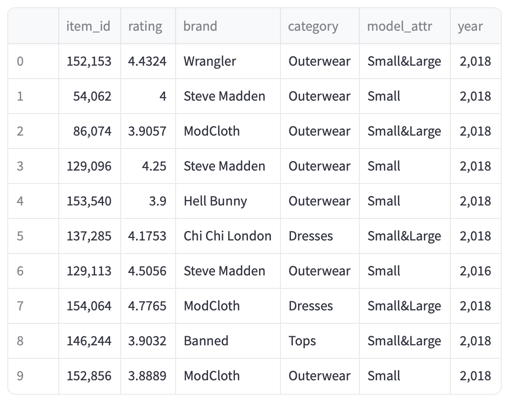

# Machine Learning Term Project - Team 2

 
Recommendation system using Content Based Filtering and Collaborate Filtering

 

## Dataset

**df_modcloth.csv**

- **item_id**: Item's ID (integer)
- **user_id**: User's ID (string)
- **rating**: User's product rating (float)
- **timestamp**: Timestamp of the review (string)
- **size**: Product size (string)
- **fit**: Product fit (string)
- **user_attr**: User attributes (string)
- **model_attr**: Attributes of the model (string)
- **category**: Product category (string)
- **brand**: Product brand (string)
- **year**: Year the product was released (integer)
- **split**: (integer)

 

## Preprocessing

1. Feature Selection & Handling Missing Value
  
  - Drop features that will not be used
    
  - Drop row with NaN as categorical value
    
2. Encoding Categorical Data
  
  - Convert categorcal value to numerical
    

 

## Content Based Filtering

After vectorizing the categorical data through one-hot encoding, calculate the cosine similarity and return the top 10 recommended items most similar to target_item_id based on the value.

 

## Collaborate Filtering

After creating a user-item rating matrix, predict the rating by dividing the matrix using SVD.

**(1) SVD model implementation**

The error value came out appropriately, but the disadvantage is that post-processing is not possible because the model is trained after filling it with 0 for cases where the user did not give a rating.

**(2) Training SVD model using Surprise library**

Compared to method (1), the error value increased, so hyperparameter tuning was performed using the GridSearchCV method, and the case with the lowest error was finally output.

 

## Deploying Content Based Model using Streamlit and FastAPI - Content Based Filtering

If you select an item_id from the sidebar on the left and press the `Get Recommendations` button, top 10 items similar to the item_id will be displayed on the screen in order.
